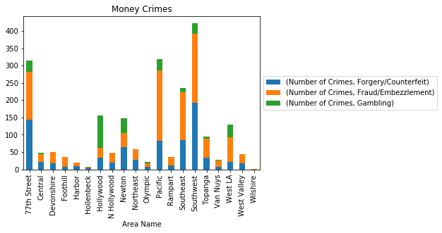
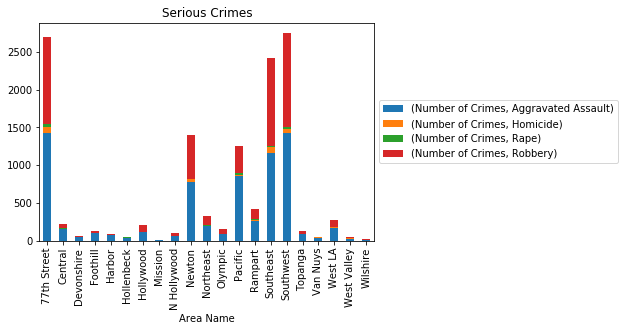

## Arrest Charges - Age Groups

**Top 5 Types of Arrest Charges in LA: Misc, DUI, Narcotic Drug Laws, Drunkenness, Moving Traffic Violations**

### Top charge types for each age group
*Items in **bold** are arrest charges unique to the group and not included in the overal top 5 arrest charges in LA.*

#### Under 20:

1. Miscellaneous Charges

2. **Pre-Delinquency**

3. **Robbery**

4. Narcotic Drug Laws

5. **Prostitution/Allied**

#### 20s to 30s:

1. Miscellaneous Charges

2. DUI

3. Narcotic Drug Laws

4. Drunkenness

5. Moving Traffic Violations

#### 40s to 50s:

1. Miscellaneous Charges

2. Drunkenness

3. Narcotic Drug Laws

4. DUI

5. **Liquor Laws**

#### 60+:

1. Drunkenness

2. Miscellaneous Charges

3. DUI

4. Narcotic Drug Laws

5. **Liquor Laws**

## Arrest Charges - Sex

### Top charge types for each sex

*Items in **bold** are arrest charges unique to the group and not included in the overall top 5 arrest charges in LA.*

#### Female:

1. **Prostitution/Allied**

2. DUI

3. Miscellaneous Charges

4. Narcotic Drug Laws

5. Drunkenness

#### Male:

1. Miscellaneous Charges

2. DUI

3. Drunkenness

4. Narcotic Drug Laws

5. Moving Traffic Violations

## Arrest Charges by Area

### Below is a graph depicting which arrest is most prevalent in each area

1. Misc/ Other

2. DUI

3. Drunkeness

4. Narcotics

5. Prostitution

### Below is a graph depicting which areas hold the largest amount of each type of arrest

1.SouthWest

2. 77th

3. Pacific

4.SouthEast

5.HollyWood

### Below is a graph stacked with arrests involving vehicles

1. 77th Street

2. Pacific

3. SouthWest

4. SouthEast

5. Newton

### Below is a graph stacked with arrests involving money

1. SouthWest

2. Pacific

3. 77th

4. SouthEast

5. Newton

### Below is a graph stacked with serious arrests

1. SouthWest

2. 77th

3. SouthEast

4. Newton

5. Pacific

